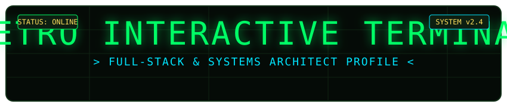
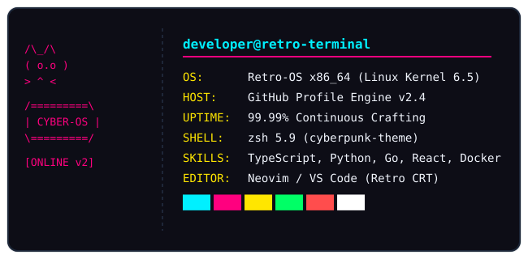

# 🖥️ Retro Interactive Terminal for GitHub README

<p align="center">
  
</p>

<p align="center">
  <a href="#-live-web-terminal-demo">
    
  </a>
  
  
  
</p>

---

## 📟 Animated README Terminal Card

Below is the **pure SVG animated terminal card** that renders directly inside GitHub Markdown with typewriter effects and scanline overlays:

<p align="center">
  
</p>

---

## 📊 System Metrics & Profile Card (Neofetch)

<p align="center">
  
</p>

---

## 🎮 Interactive Live Web Terminal Features

The repository includes a complete, standalone **Retro CRT Web Terminal Application** ready to be hosted on **GitHub Pages**, **Vercel**, or **Netlify**.

### 🌟 Key Features
- 📺 **Realistic CRT Effects**: Curved screen glass, phosphor glow, scanline overlays, subtle screen flicker.
- 🔊 **Synthesized Web Audio API**: Realistic mechanical key clicks, return enter clicks, and retro error beeps — no external MP3 sound files needed!
- 🎨 **Multiple Color Themes**:
  - `Matrix Green` (Default CRT Green Phosphor)
  - `Amber VT100` (Classic 1980s Terminal Amber)
  - `Cyberpunk Neon` (Neon Cyan & Magenta)
  - `Dracula Dark` (Modern Dark Mode)
  - `Synthwave '84` (Retro Sunset Vibes)
  - `Retro Paper` (Warm E-Ink Monochrome)
- ⌨️ **Rich Command Suite**:
  - `help` - Show interactive command manual
  - `about` - Developer profile & philosophy
  - `skills` - Tech stack & language matrix
  - `projects` - Open-source software showcase
  - `experience` - Career timeline & education
  - `contact` - Social links & communication channels
  - `neofetch` - System metrics & ASCII emblem
  - `matrix` - Fullscreen digital rain screensaver
  - `snake` - Built-in playable retro arcade Snake game!
  - `theme [name]` - Switch themes on the fly
  - `audio` - Toggle sound FX on/off
  - `cat [file]`, `ls`, `whoami`, `date`, `quote`, `clear`
- ⚡ **Interactive CLI Usability**:
  - **Tab Auto-Completion** for commands & files
  - **Up/Down Arrow History Navigation**
  - **Responsive Design** for Mobile, Tablet, and Desktop screens

---

## 🛠️ Quick Setup & Customization Guide

### 1. Run Locally
To run the live interactive web terminal locally on your machine:
```bash
# Using Python
python3 -m http.server 8000

# Or using Node npx
npx serve .
```
Then open `http://localhost:8000` in your web browser.

### 2. Host on GitHub Pages
1. Push this repository to GitHub.
2. Go to **Repository Settings** -> **Pages**.
3. Under **Build and deployment**, select **Deploy from a branch** and choose `main` / `/ (root)`.
4. Your retro web terminal will be live at `https://<your-username>.github.io/<repo-name>/`!

### 3. Embed into Your GitHub Profile README
Copy and paste the following snippet into your profile `README.md`:

```markdown
<p align="center">
  <a href="https://your-username.github.io/your-repo-name/">
    
  </a>
</p>

<p align="center">
  <a href="https://your-username.github.io/your-repo-name/">
    👉 Click here to open the Interactive Retro Terminal Console 👈
  </a>
</p>
```

---

## 📜 License
MIT License. Free to use, customize, and share!
